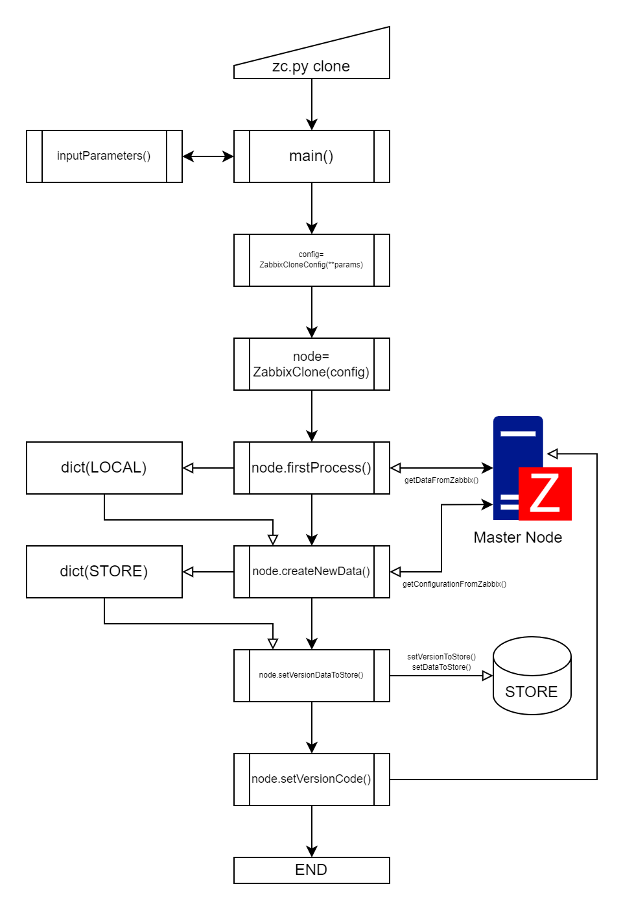
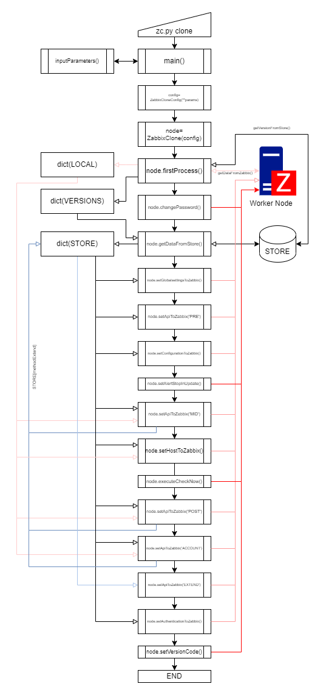

# ZC (Zabbix Clone)

# 目次
- [概要](#概要)
    - [動作環境](#動作環境)
    - [ソフトウェア要件](#ソフトウェア要件)
    - [対応するZabbixの設定](#対応するzabbixの設定)
    - [基本動作](#基本動作)
    - [用語規定](#用語規定)
- [仕様](#仕様)
    - [ノード](#ノード)
        - [マスターノード](#マスターノード)
        - [ワーカーノード](#ワーカーノード)
        - [レプリカノード](#レプリカノード)
    - [ストア](#ストア)
        - [ローカルファイル](#ローカルファイル)
        - [AWS DynamoDB](#aws-dynamodb)
        - [Redis](#redis)
        - [マスターノード直接](#マスターノード直接)
    - [実行](#実行)
        - [COMMAND](#command)
            - [clone](#clone)
            - [showversions](#showversions)
            - [showdata](#showdata)
    - [設定](#設定)
        - [設定ファイル](#設定ファイル)
            - [設定ファイルの指定](#設定ファイルの指定)
            - [設定ファイル不使用](#設定ファイル不使用)
        - [基本設定](#基本設定)
            - [ノード名](#ノード名)
            - [ロール](#ロール)
        - [接続](#接続)
            - [Zabbixエンドポイント](#zabbixエンドポイント)
            - [複製実行ユーザー](#複製実行ユーザー)
            - [複製実行ユーザーのパスワード](#複製実行ユーザーのパスワード)
            - [複製実行ユーザーのトークン](#複製実行ユーザーのトークン)
            - [HTTP認証](#http認証)
            - [自己証明書の利用](#自己証明書の利用)
        - [実行設定](#実行設定)
            - [パスワード変更](#パスワード変更)
            - [プラットフォームパスワード](#プラットフォームパスワード)
            - [強制初期化](#強制初期化)
            - [IPアドレス利用の強制](#ipアドレス利用の強制)
            - [ホスト設定の強制更新](#ホスト設定の強制更新)
            - [既存設定削除の不実行](#既存設定削除の不実行)
            - [テンプレートのスキップ](#テンプレートのスキップ)
            - [テンプレートの分離数](#テンプレートの分離数)
            - [CheckNowの実行](#checknowの実行)
            - [CheckNowを実行する監視間隔](#checknowを実行する監視間隔)
            - [ホスト適用の並列実行数](#ホスト適用の並列実行数)
        - [ストア設定](#ストア設定)
            - [ストアの指定](#ストアの指定)
            - [AWS DynamoDBの接続設定](#aws-dynamodbの接続設定)
            - [Redisの接続設定](#redisの接続設定)
            - [マスターノード直接の接続設定](#マスターノード直接の接続設定)
        - [Zabbix追加設定](#zabbix追加設定)
            - [暗号化グローバルマクロ](#暗号化グローバルマクロ)
            - [プロキシーの通信暗号化](#プロキシーの通信暗号化)
            - [一般設定](#一般設定)
            - [複製許可ユーザー](#複製許可ユーザー)
            - [特権管理権限ユーザーの複製](#特権管理権限ユーザーの複製)
            - [通知メディア設定](#通知メディア設定)
            - [MFAシークレット](#mfaシークレット)
        - [データベース設定](#データベース設定)
    - [動作概要](#動作概要)
    - [テスト状況](#テスト状況)
    - [注意事項](#注意事項)
    - [現在未対応](#現在未対応)
    - [要確認](#要確認)
    - [対応予定なし](#対応予定なし)
    - [機能追加したいもの](#機能追加したいもの)
- [FAQ](#faq)
- [免責事項](#免責事項)

<hr>

# 概要

(Will be translated into English.)

Zabbixの監視設定をAPIを使って設定元のZabbixから、監視を実行するZabbixに複製するツールです。完全なバックアップではありません。<br>
また設定元のZabbixに次の２つの設定追加を自動で実施します。

* グローバルマクロに「{$ZC_VERSION}」というマクロを追加する
* 全ホストに「ZC_UUID」というUUID情報を追加する

とりあえず7.0->7.0で動くようになったので公開します。

## 動作環境
Pythonが動作するOSなら多分どれでも。

動作確認はWindows11pro、alpine:latestコンテナ内で実行しています。

## ソフトウェア要件

* Zabbix 4.0 Later
* Python 3.9 Later

Zabbixのバージョンは4.0以降（開発系は除外）に対応予定です。

必要なPythonライブラリ:
* pyzabbix
* redis
* boto3

Zabbix6.0より前のバージョンはデータベース操作が必要になるので以下のライブラリも必要になります。

* PostgreSQL: psycopg2
* MySQL/MariaDB: pymysql

## 対応するZabbixの設定

* ホストグループ
* テンプレートグループ
* ホスト
* テンプレート
* アクション
* スクリプト
* メンテナンス
* ネットワークディスカバリ
* サービス（6.0以降）
* SLA
* イベント相関
* ユーザー
* ユーザーのメディア利用設定
* ユーザーグループ
* ロール
* 一般設定
* 暗号化グローバルマクロ
* プロキシ
* プロキシグループ
* 認証（動作未確認）
* LDAP認証設定（動作未確認）
* SAML認証設定（動作未確認）
* MFA認証設定（動作未確認）


## 基本動作

設定の複製に必要な動作は以下の２つになります。

* マスターノードに対してコマンドを実行しデータストアに監視設定を保存
* ワーカーノードに対してコマンドを実行し保存した監視設定を適用

Zabbix APIのエンドポイントに対して通信を行うため、それぞれのZabbixを動作させているマシンではない端末、例えばクライアントPC上から実行が可能です。ただしZabbix6.0より前のバージョンではデータベース操作が必要になるため、アクセス制限の関係でそれぞれのZabbix Server上で実行する必要があるかもしれません。

ストアはローカルファイル / AWS DynamoDB / Redis / マスターノード直接 の４種類に対応し、デフォルトの動作はローカルファイルになります。ローカルファイルは本ツールを実行するコンピュータのローカルにバージョンファイルを作成し、利用します。詳細は「[ストア](#ストア)」の項で説明します。

動作設定は設定ファイルとコマンドライン引数を利用します。ただしZabbix内部設定に関わる設定は設定ファイルでの対応のみになります。設定ファイルは以下の場所に設置してある場合、指定なしに読み込まれます。

* /etc/zabbix/zc.conf
* /var/lib/zabbix/conf.d/zc.conf

設定ファイルを指定する場合はコマンドライン引数で以下のように設定します。

```sh
zc.py clone --config-file ./file
```

ファイルにパスが通るなら相対パスでも絶対パスどちらでも可能です。
設定ファイルを指定した場合、上記の固定のファイルは読み込みません。

コマンドライン変数は以下の引数でヘルプが表示されます。

```sh
zc.py --help
```

設定ファイルはJSONで記述します。
```config.json
{
    "node": "monitoring node name",
    "role": "master|woker",
    "endpoint": "http://localhost:8080/",
    "user": "zabbix admin username",
    "password":"zabbix admin password",
    "update_password": "YES|NO default:NO"
    "token": "xxxxxxxxxxxxxxxxxxxxxxxxxxxxxxxx",
    "http_auth": "YES|NO default:NO",
    "self_cert": "YES|NO default:NO",
    "checknow_execute": "YES|NO default:NO",
    "store_type": "file|redis|dydb|direct",
    "store_connect": {
        "aws_access_id": "xxxxxxxxxxxxxxxxxxxxxxxxxxxxxxxx",
        "aws_secret_key": "xxxxxxxxxxxxxxxxxxxxxxxxxxxxxxxx",
        "aws_region": "us-east-1",
        "dydb_limit": 10,
        "dydb_wait": 2,
        "redis_host": "zc-master",
        "redis_port": 6379,
        "redis_password": "xxxxxxxxxxxxxxxxxxxxxxxxxxxxxxxx"
        "direct_endpoint": "http://master.node.endpoint/",
        "direct_token": "xxxxxxxxxxxxxxxxxxxxxxxxxxxxxxxxOnlyTokenAuth"
    }
}
```
詳細は「[設定](#設定)」の項で行います。

### 用語規定

#### ホスト
これ以降の説明において、「ホスト」は全てZabbix設定のホストを意味します。
例外として「データベースホスト」のみ、データベースの接続先を意味します。

#### エンドポイント
これ以降の説明において、「エンドポイント」は各機能の接続先を意味します。
例外として「データベースホスト」のみ、データベースの接続先を意味します。

# 仕様

## ノード

ZabbixCloneでは、Zabbixサーバーをノードと呼んでいます。
元は設定マスターのZabbixから監視実行Zabbixへ設定を複製しクラスター動作させることを目的としています。

### マスターノード
設定マスターZabbix / role: master

全てのZabbix設定のマスターとなるZabbix。

「ZC_UUID」のタグで、ホストのユニークを管理する。このタグはホストに存在しなければマスターノードで[clone](#clone)実行時に自動で設定します。ホスト名変えてもZC_UUIDが変わらなければ同じホスト扱いとなります。UUIDはテンプレート、ホストグループ、トリガーに既にあるためZabbix公式がホストにも適用した場合はそちらを使い、ZC_UUDタグはオミットします。

基本的にすべての設定をマスターノードからAPIで取得しますがシークレット情報はZabbix APIは出力しないため、設定ファイルに[記述](#zabbix追加設定)します。

マスターノードで監視無効にしてあるホストでも、ワーカーノードで設定する際に有効になります。

### ワーカーノード
監視実行Zabbix / role: worker

マスターノードと同じかそれより新しいバージョンのZabbixでなければいけません。

適用する複製バージョンを指定しない場合、ストアにある最新のものが適用されます。

ホストでタグ"ZC_WORKER"に動作するワーカーノードを指定し、指定されたワーカーノードで[clone](#clone)実行時にそのホストが複製されます。ホストは複製時に自動で監視開始状態になります。

ホストとプロキシー以外の設定は基本的に全て適用されます。<br>
ワーカーノードに存在しない設定は生成、存在する設定は更新されます。
マスターノードの設定に無く、ワーカーノードに存在する設定は[削除不要](#既存設定削除の不実行)を指定しない限り削除されます。

### レプリカノード
マスターノードの複製 / role: replica

ワーカーノードと違い全ホストを複製し、監視は有効にしません。
また、ユーザーのメディアタイプ設定は設定されません。

## ストア
ローカルファイル(file)  / AWS DynamoDB（dydb） / Redis（redis） / マスターノード直接（direct）<br>
デフォルトはローカルファイル

基本的にマスターノードの設定はストアに保存します。
設定は取得した際にUUIDのバージョン番号が付与されます。

### ローカルファイル
    ディレクトリ:
        Linux: /var/lib/zabbix/zc
        Windows: ユーザープロファイル\マイドキュメント\zc
    
    ファイル名フォーマット:
        バージョンUUID_タイムスタンプ_マスターノードZabbixバージョン.bz2

- バージョン指定は「UUIDのバージョン番号」を利用する。
- バージョン指定がない場合は作成タイムスタンプが最新のものを利用する。
- ファイルの場所は指定できない。
- ディレクトリを自動作成はしない。

### AWS DynamoDB
    ZC_VERSION バージョン情報
        VERSION_ID      (S) Partition Key
        UNIXTIME        (N) Sort Key
        MASTER_VERSION  (S) マスターノードのZabbixバージョン
        DESCRIPTION     (S) 補足情報

    ZC_DATA    Zabbixデータ
        VERSION_ID      (S) Partition Key
        DATA_ID         (S) Sort key
        METHOD          (S) Zabbixメソッド
        NAME            (S) メソッド内のユニーク名称
        DATA            (B) 内容のJSON出力 -> bz2圧縮

- 上記２つのテーブルは自動的に作成はしない。

### Redis
    db:0    バージョン情報  hash
        VERSION_ID: {
            'UNIXTIME': b'1234567890',
            'MASTER_VERSION': b'x.y',
            'DESACRIPTION': b'補足情報'
        }
    db:1    Zabbixデータ    hash
        VERSION_ID: {
            b'DATA_ID': b'内容のJSON出力 -> bz2圧縮',
            ...
        }

- DBを２つ利用する。
- パスワードを利用可能。

### マスターノード直接

- マスターノードの現在の設定を直接適用するのでバージョン管理はできない
- マスターノードでの作業はなく、ワーカーノード設定だけで実行する
- マスターノードへの認証はトークンのみを利用できる

## 実行

### COMMAND

|name|discription|
|:-:|:-|
|clone       |複製の実行|
|showversions|ストアに保存されているバージョンの確認|
|showdata    |ストアに保存されている対象バージョンのデータ確認|
|delete      |対象バージョンの特定データを削除（未実装）|
|clearstore  |ストア内のデータをすべて削除（未実装）|


#### clone
```sh
# マスターノードからの設定取得実行
zc.py clone --role master \
            --node master-zabbix \
            --store-type file \
            --endpoint http://master-zabbix.example.com/ \
            --user Admin \
            --password zabbix
```

```sh
# ワーカーノードへの設定複製実行
zc.py clone --role worker \
            --node worker-zabbix \
            --store-type file \
            --endpoint http://worker-zabbix.example.com/ \
            --user Admin \
            --password zabbix
```
##### option
```sh
    # 対象Zabbixの役割
    --role {master,worker,replica}

    # 対象Zabbixのサーバー名
    --node value

    # ストアの指定
    # default: file
    --store-type {file,dydb,redis,direct}

    # 対象のワーカーノードの強制初期化
    --force-initialize

    # テンプレートのインポートを実行しない
    --template-skip

    # ワーカーノードに既にある設定を消さない
    # 強制初期化が優先される
    --no-delete

    # ホスト適用後、LLDすべてと指定監視間隔のアイテムの値取得を実行する
    # default: 1h
    --checknow-execute
```

#### showversions
```sh
# バージョンの確認
zc.py showversions
```

##### option
```sh
    # バージョンIDとタイムスタンプ（UNIXTIME）のみ表示
    --id-only
```
#### showdata
```sh
# 保存データの確認
zc.py showdata --version xxxxxxxx-xxxx-xxxx-xxxx-xxxxxxxxxxxx
```
##### required
```sh
    # value: バージョンID
    --version value, -v value
```
##### option
```sh
    # バージョンIDとタイムスタンプ（UNIXTIME）のみ表示
    --id-only

    # 指定のメソッドのみ表示
    --method value [value ...]

    # 指定の名称のみ表示
    --name value [value ...]
```

## 設定

設定は、固定の設定ファイルまたは指定されたファイルが読み込まれた後、コマンドパラメーターが適用されて決定します。<br>
固定の設定ファイルはなくてもかまいません。

設定のCOMMANDが有効なのは[clone](#clone)のみになります。

### 設定ファイル

#### 設定ファイルの指定
    COMMAND: --config-file VALUE, -f VALUE
    VALUE: config file with PATH

設定ファイルを指定した場合、固定の設定ファイルは読み込みません。

#### 設定ファイル不使用
    COMMAND: --no-config-files

不使用を指定した場合、設定ファイルを読み込まずにコマンド引数のみを使います。

### 基本設定

#### ノード名
    COMMAND: --node VALUE, -n VALUE
    CONFIG: {"node": VALUE}
    VALUE: ZABBIX_SERVER_NAME
    
最初にログインページ内の`<div class="server-name>node">VALUE</div>`を確認します。

適用時、次の機能は複製データの内容を確認しノード名と同じなら実行します。
- ホスト: タグ「ZC_WORKER」の値
- プロキシー: ディスクリプションに記述された「ZC_WORKER:ノード名;」

#### ロール
    COMMAND: --role VALUE, -r VALUE
    CONFIG: {"role": VALUE}
    VALUE: master, worker, replica
    default: worker
    
### 接続

#### Zabbixエンドポイント
    COMMAND: --endpoint VALUE, -e VALUE
    CONFIG: {"endpoint": VALUE}
    VALUE: Zabbix URL
    default: http://localhost:8080/

`api_jsonrpc.php`は不要です。

#### 複製実行ユーザー
    COMMAND: --user VALUE, -u VALUE
    CONFIG: {"user": VALUE}
    VALUE: Zabbix Super Administration User
    default: Admin

#### 複製実行ユーザーのパスワード
    COMMAND: --password VALUE, -p VALUE
    CONFIG: {"password": VALUE}
    VALUE: Zabbix Super Admin's password / update password
    default: zabbix

[パスワード変更](#パスワード変更)を有効にした場合、このパスワードで更新します。

#### 複製実行ユーザーのトークン
    COMMAND: --token VALUE, -t VALUE
    CONFIG: {"token": VALUE}
    VALUE: zabbix token / sessionid

パスワードとトークン認証が設定されている場合、トークン認証が優先されます。<br>
Zabbix5.4以前はトークン機能が存在しませんが、セッションIDがトークンの代わりに利用できます。

#### HTTP認証
    COMMAND: --http-auth
    CONFIG: {"http_auth": "YES|NO"}
    default: NO

HTTP認証をZabbixで利用する場合に有効にします。<br>
この場合、トークン認証はできません。

#### 自己証明書の利用
    COMMAND: --self-cert
    CONFIG: {"self_cert": "YES|NO"}
    default: NO

自己証明書を利用している場合、有効にすると確認をスキップします。

### 実行設定

#### パスワード変更
    COMMAND: --update-password
    CONFIG: {"update_password": "YES|NO"}
    default: NO

複製実行ユーザーの[設定されている値](#複製実行ユーザーのパスワード)で複製実行ユーザーのパスワードを更新します。<br>
有効になっている場合、まずZabbixのデフォルト認証情報で試行します。<br>
デフォルト認証情報で認証できなかった場合、トークン認証が設定されていればそちらを試行します。<br>
既に変更が実行されていれば何もしません。

#### プラットフォームパスワード
    CONFIG: {"platform_password": value}
    value: platform generate password

Zabbix Cloud対応<br>
Zbbix CloudはAdminのパスワードをプラットフォーム側が生成しているため、それを指定します。

#### 強制初期化
    COMMAND: --force-initialize
    CONFIG: {"force_initialize": "YES|NO"}
    default: NO

ワーカーノード上の全設定を削除します。<br>
複製が実行されたことのないワーカーノードの場合、この設定がなくても強制的に初期化されます。

#### IPアドレス利用の強制
    COMMAND: --force-userip
    CONFIG: {"force_useip": "YES|NO"}
    default: NO

ホストの監視先設定を強制的にIPアドレスに変更します。<br>
FQDNからIPアドレスに変換できない場合、FQDNから変更しません。

#### ホスト設定の強制更新
    COMMAND: --force-host-update
    CONFIG: {"force_host_update": "YES|NO"}
    default: NO

ホスト名が同じでZC_UUIDが違う場合はデフォルトでは更新しませんが、有効にした場合は上書き更新します。

#### 既存設定削除の不実行
    COMMAND: --no-delete
    CONFIG: {"no_delete": "YES|NO"}
    default: NO
    
各監視対象が監視マスターのデータにないものはデフォルトでは削除しますが、有効にした場合は削除しません。

#### テンプレートのスキップ
    COMMAND: --template-skip
    CONFIG: {"template_skip": "YES|NO"}
    default: NO

マスターノード側で有効にした場合、テンプレートのエクスポートを実行しません。<br>
ワーカーノード側で有効にした場合、テンプレートのインポートを実行しません。

#### テンプレートの分離数
    COMMAND: --template-separate INTEGER
    CONFIG: {"template_separate": INTEGER}
    default: 50

マスターノード側で有効にした場合、テンプレートのエクスポートを分離数ごとに実行します。<br>
エクスポート処理でphpの実行メモリが足りない場合、HTTP 500エラーになります。<br>
その場合はこの設定で分離数を減らしてください。

ワーカーノード側での処理はありません。

#### CheckNowの実行
    COMMAND: --checknow-execute
    CONFIG: {"checknow_execute": "YES|NO"}
    default: NO

これを有効にした場合、ホストをワーカーノードに適用後に全LLDと任意の監視間隔のアイテムの値取得を実行します。<br>
依存アイテムの場合、親アイテムも実行します

#### CheckNowを実行する監視間隔
    COMMAND: --checknow-interval VALUE [VALUE ...]
    CONFIG: {"checknow_interval": [VALUE, VALUE, ...]}
    default: 1h

アイテムの値取得を実行する監視間隔の指定で、複数指定できます。<br>
タイムサフィックス(m, h, d)は秒に展開されます。

#### ホスト適用の並列実行数
    COMMAND: --php-worker-num INTEGER
    CONFIG: {"php_worker_num": INTEGER}
    default: 4

ホストのワーカーノードへの適用を並列実行する数。<br>
php-fpmでこれを変更する場合、プロセス数を合わせて変更しなければ実行速度が落ちる可能性があります。

### ストア設定

#### ストアの指定
    COMMAND: --store-type VALUE, -s VALUE
    CONFIG: {"store_type": VALUE}
    VALUE: file, dydb, redis, direct
    default: file

Zabbix設定の保存先を指定します。

#### AWS DynamoDBの接続設定

##### AWS Account IDの指定

    COMMAND: --store-access VALUE, -sa VALUE
    CONFIG: {"store_connect": {"aws_ccount_id": VALUE}}
    VALUE: AWS Account ID

.aws/credentialを利用しない場合に設定します。

##### AWS Secret Keyの指定

    COMMAND: --store-credential VALUE, -sc VALUE
    CONFIG: {"store_connect": {"aws_secret_key": VALUE}}
    VALUE: AWS Secret Key

.aws/credentialを利用しない場合に設定します。

##### AWS Regionの指定
    COMMAND: --store-endpoint VALUE, -se VALUE
    CONFIG: {"store_connect": {"aws_region": VALUE}}
    VALUE: AWS Secret Key
    default: us-east-1

.aws/credentialを利用しない場合に設定します。

##### 操作レコードの制限数
    COMMAND: --store-limit INTEGER
    CONFIG: {"store_connect": {"dydb_limit": INTEGER}}
    default: 10

DymanoDBの負荷制御のパラメータ―、制限数<br>
制限数ごとに待機秒数のインターバルを挟みます。

##### バッチ操作待機秒数
    COMMAND: --store-interval INTEGER
    CONFIG: {"store_connect": {"dydb_wait": INTEGER}}
    default: 2

DymanoDBの負荷制御のパラメータ―、待機秒数<br>
制限数ごとに待機秒数のインターバルを挟みます。

#### Redisの接続設定

##### Redisのエンドポイント
    COMMAND: --store-endpoint VALUE, -se VALUE
    CONFIG: {"store_connect": {"redis_host": VALUE}}
    VALUE: IP/FQDN
    default: localhost

Redisの接続先を指定します。 

##### Reidsのポート
    COMMAND: --store-port VALUE, -sp VALUE
    CONFIG: {"store_connect": {"redis_port": VALUE}}
    VALUE: INTEGER
    default: 6379

Redisの接続先ポートを指定します。

##### Reidsのパスワード
    COMMAND: --store-credential VALUE, -sc VALUE
    CONFIG: {"store_connect": {"redis_password": VALUE}}
    VALUE: redis's setting, 'requirepass'

Redisの接続パスワードを指定します。

#### マスターノード直接の接続設定

##### マスターノード名
    COMMAND: --store-access VALUE, -sa VALUE
    CONFIG: {"store_connect": {"direct_node": VALUE}}
    VALUE: master-node ZABBIX_SERVER_NAME

マスターノードの接続先のZabbixサーバー名を指定します。

##### マスターノードエンドポイント
    COMMAND: --store-endpoint VALUE, -se VALUE
    CONFIG: {"store_connect": {"direct_endpoint": VALUE}}
    VALUE: master-node Zabbix URL

マスターノードのZabbixエンドポイントを指定します。<br>
`api_jsonrpc.php`の記述は不要です。

##### マスターノードトークン
    COMMAND: --store-credential VALUE, -sc VALUE
    CONFIG: {"store_connect": {"direct_token": VALUE}}
    VALUE: master-node Super Admin's Token

マスターノードの特権管理者権限トークンを指定します。

### Zabbix追加設定

#### 暗号化グローバルマクロ
    CONFIG: {"secret_globalmacro": [VALUE, VALUE, ...]}
    VALUE: {"macro": macro_name, "value": macro_VALUE}

暗号化マクロの値はZabbix APIで取得できないため、設定ファイルに暗号化対象のグローバルマクロの内容を指定します。

#### プロキシーの通信暗号化
    CONFIG: {"proxy_psk": VALUE}
    VALUE: {proxy_name: [psk_identity, psk]}

pskはZabbix APIで取得できないため、設定ファイルに指定したものを設定します。

#### 一般設定
一般設定の内、Zabbix7.0以降対応のデータ収集のタイムアウト設定と重要度名称を設定ファイルから設定します。<br>
ワーカーノード側でマスターノードと違う設定を可能にします。

##### データ収集のタイムアウト設定
    CONFIG: {"settings": {"timeout": {TARGET: VALUE}}}
    TARGET:
        zabbix_agent
        simple_check
        snmp_agent
        external_check
        db_monitor
        http_agent
        ssh_agent
        telnet_agent
        script
        browser
    VALUE: 1s-(600s|10m)
    default:
        external_check: 15s

targetのタイムアウト設定を1秒から600秒の範囲で指定します。<br>
external_checkのみ、初期設定の5sではタイムアウト発生でZabbix Serverの不正終了が頻発するためデフォルト15sを設定します。（7.0.2での確認）

##### 重要度名称の設定
    CONFIG: {"settings": {"severity": {VALUE, VALUE, ...}}}
    VALUE: {"level": {"name": "severity_name", "color": "hex_color"}}

levelは0-5の重要度レベルを指定します。<br>
hex_colorは16進数カラーコードを指定します。

#### 複製許可ユーザー
    CONFIG: {"enable_user": VALUE}
    VALUE: {"user": "password"}

マスターノードに設定されているuserをワーカーノードに複製します。<br>
パスワードはZabbix APIで取得できないため、設定ファイルに指定したものを設定します。

#### 特権管理権限ユーザーの複製
    CONFIG: {"cloning_super_admin": "YES|NO"}
    default: "NO"

特権管理権限が付与されているAdmin以外のユーザーをワーカーノードへ複製します。

#### 通知メディア設定

    CONFIG: {"media_settings": {"user": VALUE}}
    user: User with Notification
    VALUE: 
        {"to": [address, address, ...]}
        {"severity": severity}
        {"work_time": work_time}
    required: to, severity, work_time

ワーカーノードごとに通知先設定の変更を可能にする設定です。


##### severity

    CONFIG: {"severity": VALUE}
    VALUE: {"level": "YES|NO"}
    level: 0-5

##### work_time

    CONFIG: {"week_day": "HH:MM-HH:MM"}
    weed_day: Mon / Tue / Wed / Thu / Fri / Sat / Sun

##### MFAシークレット

    CONFIG: {"mfa_client_secret": VALUE}
    VALUE: {"name": "secret"}

Duoユニバーサルプロンプトで「name（名前）」に対応するクライアントシークレットを指定します。

### データベース設定
Zabbix6.0より前のバージョンでは一般設定のAPIがないためデータベース操作で直接取得します。<br>
Zabbix Server上で実行した場合、/etc/zabbix/zabbix_server.confより取得します。<br>
取得できない端末から実行する場合はこのパラメーターを設定してください。

#### データベースホスト
    COMMAND: --db-connect-host VALUE, -dbhost VALUE
    CONFIG: {"db_connect": {"host": VALUE}}
    VALUE: IP/FQDN
    default: localhost

#### データベース名
    COMMAND: --db-connect-name VALUE, -dbname VALUE
    CONFIG: {"db_connect": {"name": VALUE}}
    VALUE: Zabbix database name
    default: zabbix

#### データベース種別
    COMMAND: --db-connect-type VALUE, -dbtype VALUE
    CONFIG: {"db_connect": {"type": "mysql|pgsql"}}
    VALUE: database type
    default: pgsql

MySQL系、PostgreSQL系のみの対応になります。ポート番号の指定はできません。

#### データベース接続ユーザー
    COMMAND: --db-connect-user VALUE, -dbuser VALUE
    CONFIG: {"db_connect": {"user": VALUE}}
    VALUE: Zabbix database user
    default: zabbix

#### データベース接続パスワード
    COMMAND: --db-connect-password VALUE, -dbpswd VALUE
    CONFIG: {"db_connect": {"password": VALUE}}
    VALUE: Zabbix database user's password
    default: zabbix

## 動作概要
### マスターノード動作


### ワーカーノード動作


## テスト状況
基本的にLTSから1つ上のLTS、LTSから同じバージョン台のPoint Rleaseをテストします。<br>
それ以外はパターンが多すぎるので、誰か試したら結果教えてください。

トリガー条件式の変更がConfiguration.importで変換できるのかは現在不明です。

|master|worker|ZabbixCloud|file|dydb|redis|direct|
|:-:|:-:|:-:|:-:|:-:|:-:|:-:|
|7.0|7.0|OK|OK|OK|OK|OK|
|6.0|7.0|*1|||||
|6.0|6.4|N/A|||||
|6.0|6.2|N/A|||||
|6.0|6.0|N/A|||||
|5.0|6.0|N/A|?|?|?|?|
|5.0|5.4|N/A|?|?|?|?|
|5.0|5.2|N/A|||||
|5.0|5.0|N/A|||||
|4.0|5.0|N/A|||||
|4.0|4.4|N/A|||||
|4.0|4.2|N/A|||||
|4.0|4.0|N/A|||||

*1: ZabbixCloudが7.0の間のみ

## 注意事項

2024/10月現在
* super admin roleでの実行、Adminを想定
* usergroupの「Zabbix administrators」の名前は変更してはいけない
* マスターノードの初回実行で全ホストに「ZC_UUID」のタグが付与される<br>
またグローバルマクロに「{$ZC_VERSION}」が自動追加される<br>
マスターノードに行う加工はこの２つだけだが、一切の変更をしないというツールではない
* バックアップ機能ではないので、自動登録されたものは複製できない<br>
自動登録（LLD、ディスカバリ、自動登録アクション）のホスト／アイテム／トリガーはワーカーノードでそれぞれ実行されて登録される
* 監視設定はテンプレートのみ（configuration.export/importを利用）<br>
ホストに直接設定されたアイテム/トリガーは破棄される（Zabbixのバージョンで使える使えないの判定、トリガー書式の変換処理とかやってられない）
* ホストはhost.(create|update)の実行<br>
けれどconfiguration.importでホストを処理しないのはホスト数が多いとタイムアウトで失敗するため<br>
（httpd/nginxのtimeout設定にもよるけどデフォルトだと100ちょっとくらい、phpのメモリ設定も無駄にでかくなる）<br>
1ホストずつのAPI実行でタイムアウトを回避、並列実行で実行時間の短縮（4並列でだいたい半分くらい）<br>
configuration.importの項目チェック機能が厳密化実装以降わりとバグるのでホストの処理にまでその対応を入れたくない<br>
不要になった項目吐いてるのに食わせるとエラーになるとか
* トリガーアクションでトリガー指定は複製できない（複製の指定（ホスト＆トリガー、自動登録も考慮）が非常に面倒なので）
* ワーカーノードでは「イベント相関関係」「ネットワークディスカバリ」「アクション」「スクリプト」「メンテナンス」は必ず消去しあとで追加を行う<br>
これはホストやホストグループなど多種要素により、要不要判定しにくいため<br>
no_deleteで消さないようにしてるけど、他の消すところも消えなくなる
* Zabbix5.4でトリガーの書式変換が必要になるが、そのあたりまだテストしてない（configuration.importが処理してくれる？）
* Zabbix5.4より前はトークンのシステムがないが、セッションIDが同じものとして使える
* 画面出力は全部仮実装、そのうちちゃんとloggerとかでログにも吐けるように実装しなおし予定
* Zabbix Cloudに対応したものの、\<div class="server-name">ZABBIX_SERVER_NAME\</div>が「Zabbix」固定で大変困る<br>
（ノードに割り当てるホストとプロキシの指定にここ使ってる）

## 現在未対応
* コネクタ（7.0機能、まだ使ったことがないのでよくわからない）

## 要確認
* ネットワークディスカバリ（まだプロキシグループに対応していないので、7.2以降変更ありそう）

## 対応予定なし
主にUI関連
*  Zabbix 1.x/2.x/3.x
* スクリーン
* ダッシュボード（いくらでも複雑にできて対応が大変）
* レポート（ダッシュボードの指定が必要なため）
* アイコン
* イメージ

## 機能追加したいもの
* git対応
* 公式テンプレートのダイレクトインポート
* ワーカーノード側の実行前バックアップ
* 失敗時の戻し

# FAQ
質問がたまったら作る、質問来るほど使われない気もする。

# 免責事項

このスクリプトはMITライセンスを採用しています。
スクリプトを実行した結果の責任は一切負いません。
