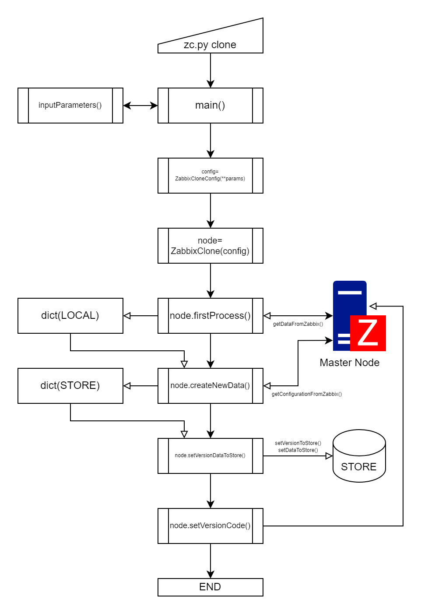

# ZC (Zabbix Clone)
[Japanese](readme.md)
# Contents
- [Overview](#overview)
    - [Environment](#environment)
    - [Requirement](#requirement)
    - [Supported Zabbix Configuration](#supported-zabbix-configuration)
    - [Operation](#operation)
    - [Terms in Document](#terms-in-documment)
- [Specification](#specification)
    - [Node](#node)
        - [Master Node](#master-node)
        - [Worker Node](#worker-node)
        - [Replica Node](#replica-node)
    - [Store](#store)
        - [Local-Files](#local-files)
        - [AWS DynamoDB](#aws-dynamodb)
        - [Redis](#redis)
        - [Master Node Direct](#master-node-direct)
    - [Execute](#execute)
        - [COMMAND](#command)
            - [clone](#clone)
            - [showversions](#showversions)
            - [showdata](#showdata)
    - [Configuration](#configuration)
        - [Configuration File](#configuration-file)
            - [File Specification](#file-specification)
            - [Unuse Configuration File](#unuse-configuration-file)
        - [Base Settings](#base-setting)
            - [Target Node](#target-node)
            - [Target Node's Role](#target-nodes-role)
        - [Connection Settings](#connection-settings)
            - [Zabbix Endpoint](#zabbix-endpoint)
            - [Zabbix User](#zabbix-user)
            - [Zabbix Password](#zabbix-password)
            - [Zabbix Token](#zabbix-user)
            - [HTTP Authorization](#http-authorization)
            - [Use Self Certificate](#use-self-certificate)
        - [Operation Settings](#operation-settings)
            - [Change Password](#change-password)
            - [Platform Password](#platform-password)
            - [Force Initialize](#force-initialize)
            - [Force Use IPaddress](#force-use-ipaddress)
            - [Force Update Host Configuration](#force-update-host-configuration)
            - [No Delete Existing Zabbix Configuration](#no-delete-existing-zabbix-configuration)
            - [Skip Import/Export Zabbix Templates](#skip-importexport-zabbix-templates)
            - [Separate Count Export Zabbix Tmeplates](#separate-count-export-zabbix-templates)
            - [Execute CheckNow](#execute-checknow)
            - [Target CheckNow Item's Interval](#target-checknow-items-interval)
            - [Number of Parallel Excutions](#number-of-parallel-executions)
        - [Store Settings](#store-settings)
            - [Store Type](#store-type)
            - [AWS DynamoDB Connection Settings](#aws-dynamodb-connection-settings)
            - [Redis Connection Settings](#redis-connection-settings)
            - [Master Node Direct Settings](#master-node-direct-settings)
        - [Zabbix Extra Configurations](#zabbix-extra-configurations)
            - [Crypted Global-Macro](#crypted-global-macro)
            - [Proxy PSK](#proxy-psk)
            - [General Settings](#general-settings)
            - [Enable User with Cloning](#enable-user-with-cloning)
            - [Allow Cloning Super Admin's Settings](#allow-cloning-super-admins-settings)
            - [Notification Media Settings](#notification-media-settings)
            - [MFA Secret](#mfa-secret)
        - [Database Settings](#database-settings)
    - [Processing Flow](#processing-flow)
    - [Test Status](#test-status)
    - [Notes](#notes)
    - [Currently Unsupported Features](#currently-unsupported-features)
    - [Fix in Future Version](#fix-in-future-version)
    - [Not Supported](#not-supported)
    - [Functions to Add](#functions-to-add)
- [FAQ](#faq)
- [Disclaimers](#disclaimers)

<hr>

# Overview

This ReadMe is [Translated with Deep](https://www.deepl.com/).

This Tool to Cloning Zabbix monitoring configuration from source Zabbix to running Zabbix with Zabbix API. It is not a complete configuration backup.<br>
It also automatically add the following two settings to the source Zabbix.

* Add a macro named "{$ZC_VERSION}" to the global macro
* Add Tag "ZC_UUID" to all Hosts

Now that it works with 7.0->7.0, Releasing it to the public.

## Environment
Probably any OS that runs Python.<br>
Checking operation within Windows11pro and alpine:latest container.

## Requirement

* Zabbix 4.0 Later
* Python 3.9 Later

Zabbix 4.0 or later (excluding development versions) will be supported.

Required Python Library:
* pyzabbix
* redis
* boto3

Required extra libraries for Versions before Zabbix 6.0.

* PostgreSQL: psycopg2 (psycopg2-binary)
* MySQL/MariaDB: pymysql

## Supported Zabbix Configuration

* hostgroup
* templategroup (Zabbix6.2 or later)
* host
* template
* action (trigger/service/discovery/internal)
* script
* maintenance
* network discovery
* service (Zabbix6.0 or later)
* sla
* event corellateion
* user
* user's media-type
* usergroup
* role (Zabbix5.2 or later)
* general settings
* crypted globalmacro (Zabbix5.0 or later)
* proxy
* proxy group (Zabbix7.0 or later)
* authentication (Not tested)
* LDAP authentication setting (Not tested)
* SAML authentication setting (Not tested)
* MFA authentication setting (Not tested)

## Operation

Two operations are required for cloning.

* Execute command on master node and save the monitoring configuration.
* Execute command targeting worker nodes and apply monitoring configuration.

Execute API to Zabbix endpoints, so it can be run on a terminal that is not the machine running Zabbix, e.g. on a client PC. However, version before Zabbix6.0 require database operations and should be run on a machine running Zabbix with database access.

4 types of stores are supported: Local-Files, AWS DynamoDB, Redis, and Master Node Direct. Default is Local-Files. Local-Files outputs and uses files on the disk of the computer to execute. See "[store](#store)" for details.

Operation is configured in the configuration file and command line arguments. However, Zabbix Extra settings are only supported in configuration file. Configuration files are read from a fixed path.

* /etc/zabbix/zc.conf
* /var/lib/zabbix/conf.d/zc.conf

To specify a configuration file, use command line arguments.

```sh
zc.py clone --config-file ./file
```

File paths can be either relative or absolute.
If a configuration file is specified, the above fixed file not be loaded.

Help is displayed with "--help".

```sh
zc.py --help
```

Configuration file is written in JSON.
```config.json
{
    "node": "monitoring node name",
    "role": "master|woker",
    "endpoint": "http://localhost:8080/",
    "user": "zabbix admin username",
    "password":"zabbix admin password",
    "update_password": "YES|NO default:NO"
    "token": "xxxxxxxxxxxxxxxxxxxxxxxxxxxxxxxx",
    "http_auth": "YES|NO default:NO",
    "self_cert": "YES|NO default:NO",
    "checknow_execute": "YES|NO default:NO",
    "store_type": "file|redis|dydb|direct",
    "store_connect": {
        "aws_access_id": "xxxxxxxxxxxxxxxxxxxxxxxxxxxxxxxx",
        "aws_secret_key": "xxxxxxxxxxxxxxxxxxxxxxxxxxxxxxxx",
        "aws_region": "us-east-1",
        "dydb_limit": 10,
        "dydb_wait": 2,
        "redis_host": "zc-master",
        "redis_port": 6379,
        "redis_password": "xxxxxxxxxxxxxxxxxxxxxxxxxxxxxxxx"
        "direct_endpoint": "http://master.node.endpoint/",
        "direct_token": "xxxxxxxxxxxxxxxxxxxxxxxxxxxxxxxxOnlyTokenAuth"
    }
}
```
See "[Configuration](#configuration)" for details.

### Terms in Documment

#### Host
In this documentation, "host" refers to host of Zabbix configuration.<br>
The only exception is "database host", which means the database connection point.

#### Endpoint
In this documantation, "endpoint" refers to connection point for each function.<br>
The only exception is "database host", which means the database connection point.

# Specification

## Node

In this tool, Zabbix server are called "node".

### Master Node
Configuration source Zabbix / role: master

Zabbix server to be configured from

"ZC_UUID" tag manages host uniqueness. This tag is automatically set at cloning time on master node if it does not exist on host(s).
If name of host is changed but the ZC_UUID's value is not changed, it is treated as the same host. UUID is already present in the template, hostgroup, templategroup and trigger, so if Zabbix official applies it to host as well, will use that and omit ZC_UUD tag.

Basically, all settings are retrieved from the master node via API, but secret information is [added in configuration file](#zabbix-extra-configurations) since Zabbix API does not output secret information.

Host that have UnMonitored on master node is Monitored when configured on worker nodes.

### Worker Node
Zabbix to Run monitoring / role: worker

It must be the same or newer version of Zabbix as master node. If you do not specify a cloning version to apply, latest in store is applied.

Specify a worker node that operates on tag "ZC_WORKER" in the host, and host is cloning when [clone](#clone) is executed on the specified worker node.
Host are automatically Monitored when they are cloned.

All settings are applied except for host, proxy and a few that [needs to be written in configuration file](#zabbix-extra-configurations).<br>
Settings that do not exist on worker nodes are created, and those that do are updated.
Configurations that are not in master node and exist in worker nodes are deleted unless [no_delete](#no-delete-existing-zabbix-configuration) is specified.

### Replica Node
Replica of Master Node / role: replica

Unlike worker nodes, it clone all hosts, but does not Monitored.
Also, [extra user media type settings](#notification-media-settings) are not applied.

## Store
Local-Files (file)  / AWS DynamoDB（dydb） / Redis（redis） / Master Node Direct（direct）<br>
Default setting is Local-Files.

Master node Configuration is stored in specified store, except for Master Node Direct.
Configuration is assigned a version UUID when they are acquired.

### Local-Files
    Directory:
        Linux: /var/lib/zabbix/zc
        Windows: %userprofile%\documets\zc
    
    Filename Format:
        versionUUID_timestamp_masterNodeZabbixVersion.bz2

- Use "version UUID" to specify version.
- If no version is specified, the latest creation timestamp is used.
- Directory can not be specified.
- Directory is not automatically created.

### AWS DynamoDB
    ZC_VERSION: Version's Information for configuration
        VERSION_ID      (S) Partition Key
        UNIXTIME        (N) Sort Key
        MASTER_VERSION  (S) Master Node Zabbix Version
        DESCRIPTION     (S) Description

    ZC_DATA: Zabbix configuration data in version
        VERSION_ID      (S) Partition Key
        DATA_ID         (S) Sort key
        METHOD          (S) Zabbix method
        NAME            (S) Unique Name in method
        DATA            (B) JSON Data -> bz2 compress

- There Tables are not automatically created.

### Redis
    db:0  Version's Information, hash
        VERSION_ID: {
            'UNIXTIME': b'1234567890',
            'MASTER_VERSION': b'x.y',
            'DESACRIPTION': b'description'
        }
    db:1  Zabbix configuration data in version, hash
        VERSION_ID: {
            b'DATA_ID': b'JSON Data -> bz2 compress',
            ...
        }

- Use 2 redis db.
- Password available.

### Master Node Direct

- Versioning is not possible because current configuration of master node is directly applied.
- Execute only on worker nodes.
- Only token authentication, to master node.

## Execute

### COMMAND

|name|discription|
|:-:|:-|
|clone       |Execute Cloning.|
|showversions|Show Versions on Store.|
|showdata    |Show Data in Specified Version|
|delete      |Delete Specified Data（未実装）|
|clearstore  |Clear All Store Data.（未実装）|


#### clone
```sh
# Execution of configuration get from master node
zc.py clone --role master \
            --node master-zabbix \
            --store-type file \
            --endpoint http://master-zabbix.example.com/ \
            --user Admin \
            --password zabbix
```

```sh
# Execution of configuration cloning for worker nodes
zc.py clone --role worker \
            --node worker-zabbix \
            --store-type file \
            --endpoint http://worker-zabbix.example.com/ \
            --user Admin \
            --password zabbix
```
##### option
```sh
    # Target Node's Role
    --role {master,worker,replica}

    # Target Node's Zabbix Name(ZBX_SERVER_NAME)
    --node value

    # Specified Store
    # default: file
    --store-type {file,dydb,redis,direct}

    # Force Initialized worker nodes
    --force-initialize

    # Skip Template Import/Export
    --template-skip

    # No Delete Existing Zabbix Configuration
    # Invalid if forced initialization is specified.
    --no-delete

    # After host cloning, Execute CheckNow
    # default: 1h
    --checknow-execute
```

#### showversions
```sh
# Show versions on store
zc.py showversions
```

##### option
```sh
    # Display only version UUID and timestamp
    --id-only
```
#### showdata
```sh
# Show data in specified version
zc.py showdata --version xxxxxxxx-xxxx-xxxx-xxxx-xxxxxxxxxxxx
```
##### required
```sh
    # value: Specified version UUID
    --version value, -v value
```
##### option
```sh
    # Display only data UUID and unique name in method
    --id-only

    # Display only specified method data
    --method value [value ...]

    # Display only speciled name (existing in each/specified method)
    --name value [value ...]
```

## Configuration

Configuration is decided fixed configuration files or specified file, override by command line arguments after be decided by files.<br>
COMMAND is command line argument, only valid with [clone](#clone).

### Configuration File

#### File Specification
    COMMAND: --config-file VALUE, -f VALUE
    VALUE: config file with PATH

If use this argument, do not read fixed configuration files.

#### Unuse Configuration File
    COMMAND: --no-config-files

If use this argument, only applied command line arguments.

### Base Setting

#### Target Node
    COMMAND: --node VALUE, -n VALUE
    CONFIG: {"node": VALUE}
    VALUE: ZABBIX_SERVER_NAME
    
First check `<div class="server-name>node">VALUE</div>` in the login page source.

If the value is same as VALUE, configuration is applied with worker nodes processing.

- host: value for "ZC_WORKER" tag.
- proxy: In description, "ZC_WORKER:VALUE;"

#### Target Node's Role
    COMMAND: --role VALUE, -r VALUE
    CONFIG: {"role": VALUE}
    VALUE: master, worker, replica
    default: worker

### Connection Settings

#### Zabbix Endpoint
    COMMAND: --endpoint VALUE, -e VALUE
    CONFIG: {"endpoint": VALUE}
    VALUE: Zabbix URL
    default: http://localhost:8080/

`api_jsonrpc.php` is not reqiued.

#### Zabbix User
    COMMAND: --user VALUE, -u VALUE
    CONFIG: {"user": VALUE}
    VALUE: Zabbix Super Administration User in Node
    default: Admin

#### Zabbix Password
    COMMAND: --password VALUE, -p VALUE
    CONFIG: {"password": VALUE}
    VALUE: Zabbix Super Admin's password / update password
    default: zabbix

If [Change Password](#change-password) is enabled, update with this password.

#### Zabbix Token
    COMMAND: --token VALUE, -t VALUE
    CONFIG: {"token": VALUE}
    VALUE: zabbix token in Node / Authorized sessionid

If [password](#zabbix-password) and this setting are enabled, override token authorization.<br>
Before Zabbix5.4, this feature does not exist, but SessionID can be used instead.

#### HTTP Authorization
    COMMAND: --http-auth
    CONFIG: {"http_auth": "YES|NO"}
    default: NO

Enable HTTP authentication on node.<br>
If enabled this, invalidate Zabbix Token.

#### Use Self Certificate
    COMMAND: --self-cert
    CONFIG: {"self_cert": "YES|NO"}
    default: NO

If this setting is enabled, do not check certificate. 

### Operation Settings

#### Change Password
    COMMAND: --update-password
    CONFIG: {"update_password": "YES|NO"}
    default: NO

If this setting is enabled, change password for [user](#zabbix-user) with [password VALUE](#zabbix-password).
<br>
Already changed password, do nothing.

#### Platform Password
    CONFIG: {"platform_password": VALUE}
    VALUE: platform generated password

for Zabbix Cloud<br>
Zabbix Cloud generates password for "Admin".<br>
Can not use Admin's default passowrd.

#### Force Initialize
    COMMAND: --force-initialize
    CONFIG: {"force_initialize": "YES|NO"}
    default: NO

Delete all Zabbix configuration on worker nodes.<br>
If "{$ZC_VERSION}" is not in globalmacro on worker nodes, do same operation.

#### Force Use IPaddress
    COMMAND: --force-userip
    CONFIG: {"force_useip": "YES|NO"}
    default: NO

Force conversion of host monitoring endpoint to IPaddress.<br>
If cannot convert to IPaddress, endpoint not be changed from FQDN. 

#### Force Update Host Configuration
    COMMAND: --force-host-update
    CONFIG: {"force_host_update": "YES|NO"}
    default: NO

Host is same but ZC_UUID's value is different, it not be updated.<br>
If this argument is specified, host is forced to update.

#### No Delete Existing Zabbix Configuration
    COMMAND: --no-delete
    CONFIG: {"no_delete": "YES|NO"}
    default: NO

Zabbix configuration deleted on the master node also be deleted on worker nodes.<br>
If this argument is specified, it not be deleted.

#### Skip Import/Export Zabbix Templates
    COMMAND: --template-skip
    CONFIG: {"template_skip": "YES|NO"}
    default: NO

If this argument is specified, template export from master node and template import to worker nodes is not executed.

#### Separate Count Export Zabbix Templates 
    COMMAND: --template-separate INTEGER
    CONFIG: {"template_separate": INTEGER}
    default: 50

If this argument is specified, template export from master node is sepalated each INTEGER.<br>
This argument is not enabled worker nodes.

#### Execute CheckNow
    COMMAND: --checknow-execute
    CONFIG: {"checknow_execute": "YES|NO"}
    default: NO

If this argument is scpecified, Execute value retrieval of all LLDs and items of any monitoring interval after host is applied.<br>
For dependent items, parent items are also executed.

#### Target CheckNow Item's Interval
    COMMAND: --checknow-interval VALUE [VALUE ...]
    CONFIG: {"checknow_interval": [VALUE, VALUE, ...]}
    default: 1h

This argument specifies one or more intervals of value retrieval with "--checknow-execute".<br>
Timesuffix (m, h, d) is converted to seconds.

#### Number of Parallel Executions
    COMMAND: --php-worker-num INTEGER
    CONFIG: {"php_worker_num": INTEGER}
    default: 4

Number of parallel host imports to be executed.

### Store Settings

#### Store Type
    COMMAND: --store-type VALUE, -s VALUE
    CONFIG: {"store_type": VALUE}
    VALUE: file, dydb, redis, direct
    default: file

This argument specifies the store where zabbix configurations are stored.

#### AWS DynamoDB Connection Settings

##### AWS Account ID

    COMMAND: --store-access VALUE, -sa VALUE
    CONFIG: {"store_connect": {"aws_ccount_id": VALUE}}
    VALUE: AWS Account ID

Specify if "~/.aws/credential" is not used.

##### AWS Secret Key

    COMMAND: --store-credential VALUE, -sc VALUE
    CONFIG: {"store_connect": {"aws_secret_key": VALUE}}
    VALUE: AWS Secret Key

Specify if "~/.aws/credential" is not used.

##### AWS Region
    COMMAND: --store-endpoint VALUE, -se VALUE
    CONFIG: {"store_connect": {"aws_region": VALUE}}
    VALUE: AWS Secret Key
    default: us-east-1

Specify if "~/.aws/credential" is not used.

##### Limit Count of Processing Records
    COMMAND: --store-limit INTEGER
    CONFIG: {"store_connect": {"dydb_limit": INTEGER}}
    default: 10

BATCH processing count, Specify to control DynamoDB load.<br>
Interval for each BATCH processing count.

##### Interval of Batch Processing
    COMMAND: --store-interval INTEGER
    CONFIG: {"store_connect": {"dydb_wait": INTEGER}}
    default: 2

Interval, Specify to control DynamoDB load.<br>
Interval for each BATCH processing count.

#### Redis Connection Settings

##### Redis Endpoint
    COMMAND: --store-endpoint VALUE, -se VALUE
    CONFIG: {"store_connect": {"redis_host": VALUE}}
    VALUE: IP/FQDN
    default: localhost

Specify Redis endpoint.

##### Reids Port
    COMMAND: --store-port VALUE, -sp VALUE
    CONFIG: {"store_connect": {"redis_port": VALUE}}
    VALUE: INTEGER
    default: 6379

Specify Redis port with endpoint.

##### Reids Password
    COMMAND: --store-credential VALUE, -sc VALUE
    CONFIG: {"store_connect": {"redis_password": VALUE}}
    VALUE: redis's setting, 'requirepass'

Specify Redis password.

#### Master Node Direct Settings

##### Target Master Node
    COMMAND: --store-access VALUE, -sa VALUE
    CONFIG: {"store_connect": {"direct_node": VALUE}}
    VALUE: master-node ZABBIX_SERVER_NAME

Specify ZABBIX_SERVER_NAME of master node.

##### Master Node Ednpoint
    COMMAND: --store-endpoint VALUE, -se VALUE
    CONFIG: {"store_connect": {"direct_endpoint": VALUE}}
    VALUE: master-node Zabbix URL

Specify Zabbix endpoint of master node.<br>
`api_jsonrpc.php` is not reqiued.

##### Master Node Token
    COMMAND: --store-credential VALUE, -sc VALUE
    CONFIG: {"store_connect": {"direct_token": VALUE}}
    VALUE: master-node Super Admin's Token

Specify Super Administrator token of master node.

### Zabbix Extra Configurations

#### Crypted Global Macro
    CONFIG: {"secret_globalmacro": [VALUE, VALUE, ...]}
    VALUE: {"macro": macro_name, "value": macro_VALUE}

Zabbix API does not return crypted value of usermacro.<br>
VALUEs of encryption usermacro are listed in Configuration.

#### Proxy PSK
    CONFIG: {"proxy_psk": VALUE}
    VALUE: {proxy_name: [psk_identity, psk]}

Zabbix API does not return proxy PSK.<br>
VALUEs of proxy PSK are listed in Configuration.

#### General Settings
Configure timeout settings for data collection and severity name/color in General Settings for Zabbix 7.0 or later.<br>
Enables worker nodes to be configured differently from master node.

##### Timeout Settings for Data Collection
    CONFIG: {"settings": {"timeout": {TARGET: VALUE}}}
    TARGET:
        zabbix_agent
        simple_check
        snmp_agent
        external_check
        db_monitor
        http_agent
        ssh_agent
        telnet_agent
        script
        browser
    VALUE: 1s-(600s|10m)
    default:
        external_check: 15s

Zabbix7.0 or later.<br>
Specify TARGET timeout setting in 1 to 600 seconds.<br>
For external_check only, default setting of 5s may cause timeouts, so set 15s by ZC.<br>
If external_check's timeout occurs, Zabbix Server crash unexpectedly. (Confirmed on 7.0.2)

##### Severity Settings
    CONFIG: {"settings": {"severity": {VALUE, VALUE, ...}}}
    VALUE: {"level": {"name": "severity_name", "color": "hex_color"}}

Specify level of severity from 0-5, enclose in double quotes.<br>
hex_color specifies hexadecimal color code.

#### Enable User with Cloning
    CONFIG: {"enable_user": VALUE}
    VALUE: {"user": "password"}

Enables any specified user set on master node to be cloned to worker nodes.<br>
Zabbix API does not return user's password.<br>
Password are listed in Configuration.

#### Allow Cloning Super Admin's Settings
    CONFIG: {"cloning_super_admin": "YES|NO"}
    default: "NO"

Enables update Super Administorator user (not Admin) configuration in master node to worker nodes.<br>
This argument is valid when "Enable User with Cloning" is specified.
#### Notification Media Settings

    CONFIG: {"media_settings": {"user": VALUE}}
    user: User with Notification
    VALUE: 
        {"to": [address, address, ...]}
        {"severity": severity}
        {"work_time": work_time}
    required: to, severity, work_time

Enables specification of mediatype settings for each worker nodes.

##### severity

    CONFIG: {"severity": VALUE}
    VALUE: {"level": "YES|NO"}
    level: 0-5

[See Zabbix documentation.](https://www.zabbix.com/documentation/current/en/manual/config/notifications/media#user-media)

##### work_time

    CONFIG: {"week_day": "HH:MM-HH:MM"}
    weed_day: Mon / Tue / Wed / Thu / Fri / Sat / Sun

[See Zabbix documentation.](https://www.zabbix.com/documentation/current/en/manual/config/notifications/media#user-media)

##### MFA Secret

    CONFIG: {"mfa_client_secret": VALUE}
    VALUE: {"name": "secret"}

Specify the client secret for "name" at the Duo universal prompt.

### Database Settings
Before Zabbix6.0 do not have API for general settings, so they are directly retrieved via database operations.<br>
Executed on Zabbix Server, Get database connection settings from "/etc/zabbix/zabbix_server.conf".<br>
Set this settings when executing from a terminal that cannot obtain database connection settings.

#### Database Host
    COMMAND: --db-connect-host VALUE, -dbhost VALUE
    CONFIG: {"db_connect": {"host": VALUE}}
    VALUE: IP/FQDN
    default: localhost

#### Database Name
    COMMAND: --db-connect-name VALUE, -dbname VALUE
    CONFIG: {"db_connect": {"name": VALUE}}
    VALUE: Zabbix database name
    default: zabbix

#### Database Type
    COMMAND: --db-connect-type VALUE, -dbtype VALUE
    CONFIG: {"db_connect": {"type": "mysql|pgsql"}}
    VALUE: database type

Only MySQL and PostgreSQL are supported. Port numbers cannot be specified.

#### Database User
    COMMAND: --db-connect-user VALUE, -dbuser VALUE
    CONFIG: {"db_connect": {"user": VALUE}}
    VALUE: Zabbix database user
    default: zabbix

#### Database User's Password
    COMMAND: --db-connect-password VALUE, -dbpswd VALUE
    CONFIG: {"db_connect": {"password": VALUE}}
    VALUE: Zabbix database user's password
    default: zabbix

##  Processing Flow
### Master Node Processings


### Worker Node Processings


## Test Status
I'll test (X+1).0 LTS and X.2/X.4 Point-release from X.0 LTS.<br>
Other than that, there are many patterns, so if anyone tries it, please let me know the results.

It is currently unknown if changes to trigger expressions (Zabbix5.4 or later) can be converted in configuration.import().

* 6.0 -> 6.2/6.4, Trigger prototype's dependencies cannot import.
* 6.0 -> later, Some 6.0's templates, Template configured hostgroup for hostprototype cannot be registered because that hostgroup is changed templategroup.

"-" is skiped tests because it's same codes as 7.0 -> 7.0 tests.

|master|worker|ZabbixCloud|file|dydb|redis|direct|
|:-:|:-:|:-:|:-:|:-:|:-:|:-:|
|7.0|7.0|OK|OK|OK|OK|OK|
|6.0|7.0|*1|OK|-|-|-|
|6.0|6.4|N/A|OK?|-|-|-|
|6.0|6.2|N/A|OK?|-|-|-|
|6.0|6.0|N/A|OK|-|-|-|
|5.0|6.0|N/A|OK|-|-|-|
|5.0|5.4|N/A|OK|-|-|-|
|5.0|5.2|N/A|OK|-|-|-|
|5.0|5.0|N/A|OK|-|-|-|
|4.0|5.0|N/A|||||
|4.0|4.4|N/A|||||
|4.0|4.2|N/A|||||
|4.0|4.0|N/A|||||

*1: Only while ZabbixCloud is Zabbix7.0

## Notes

2024/10 (ja -> en Translated by DeepL and not corrected.)
 * Running in super admin role, assuming Admin.
* name of "Zabbix administrators" in usergroup must not be changed.
* All hosts will be tagged with "ZC_UUID" on first run of master node.<br>
Also, "{$ZC_VERSION}" will be automatically added to global macro.<br>
These are the only two modifications to the master node, but it is not a tool that does not make any modification at all.
* Automatic registration cannot be duplicated since it is not a backup function.<br>
Automatic registration (LLD, discovery, auto-registration action) hosts/items/triggers are executed and registered on worker nodes respectively
* Monitoring configuration is template only (using configuration.export/import).<br>
Items/triggers configured directly on hosts will be discarded (we don't have time to decide which Zabbix version is usable or not, convert trigger formats, etc.)
* Hosts are created by running host.(create|update).<br>
(create|update), but configuration.import doesn't handle hosts because it will fail with timeout if there are too many hosts.<br>
(It depends on the timeout setting of httpd/nginx, but the default is about 100 or so, and the memory setting of php is also unnecessarily large.
(The default timeout is about 100 or so, depending on the httpd/nginx timeout setting, but the default is about 100 or so.
The configuration.import item check function has been rather buggy since its strict implementation, so we don't want to include that in the host processing.<br>
I don't want to include it in the host processing.
* Trigger specification cannot be duplicated in trigger action (because it is very troublesome to specify duplication (host & trigger, automatic registration also considered)).
* On worker nodes, "Event Correlation", "Network Discovery", "Action", "Script", and "Maintenance" must be deleted and added later.<br>
This is because it is difficult to judge whether they are necessary or not due to various factors such as hosts and host groups/<br>
I use no_delete to keep them from disappearing, but it also keeps other things from disappearing
* Zabbix 5.4 will require trigger format conversion, but I haven't tested it yet (maybe configuration.import will handle it?).
* Prior to Zabbix 5.4 there was no token system, but session ID can be used as the same one.
* All screen output is temporary and will be re-implemented to be properly logged in logger or something.
* Zabbix Cloud is supported, but the \<div class=“server-name”>ZABBIX_SERVER_NAME\</div> is fixed to “Zabbix”, which is very annoying.<br>
(I use it to specify hosts and proxies to be assigned to nodes)

## Currently Unsupported Features
* Connector (add 7.0, I don't know, I haven't used it yet.)

## Fix in Future Version
* Network Discovery ( Not yet supporting proxy group, so there will be changes after 7.2.)

## Not Supported
Mainly UI
*  Zabbix 1.x/2.x/3.x
* screen
* dashboard (It's difficult because it can be as complicated as you want it to be.)
* report (Because a dashboard is required.)
* icon
* image

## Functions to Add
* git
* import from [Official template repository](https://github.com/zabbix/zabbix/tree/master/templates), etc...
* backup before cloning to worker nodes.
* function of failback on failure

# FAQ
If we get a lot of questions, we will make it. I don't think it will be used as much as questions come in.

# Disclaimers
This script is MIT licensed.<br>
We are not responsible for any consequences of your running this script.
